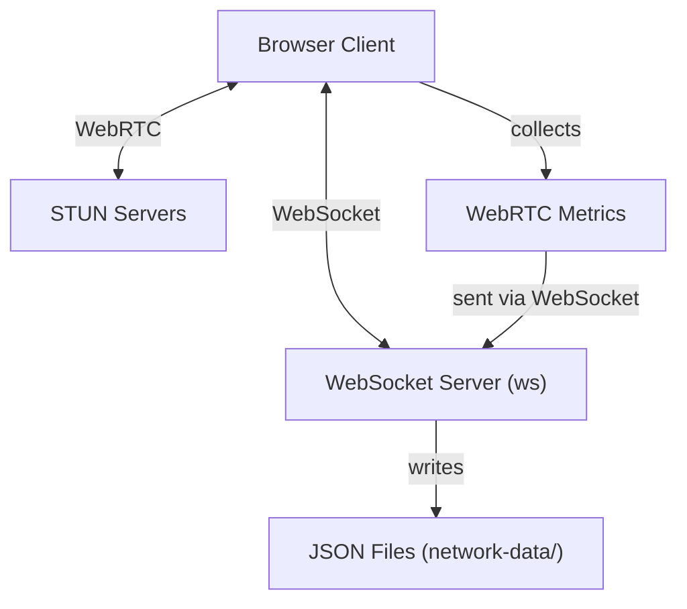
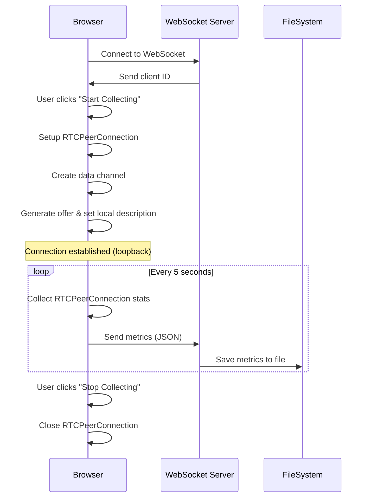

# WebRTC Metrics Collector Test Lab

A tool for testing and collecting WebRTC connection metrics. This application sets up a WebRTC peer connection and collects detailed network metrics and statistics which can be used for analysis and performance optimization.

## Project Structure

```
webrtc-metrics-collector/
├── package.json            # Node.js project configuration
├── server.js               # WebSocket signaling and metrics collection server
├── network-data/           # Directory where collected metrics are stored
└── client/                 # Client-side web application
    ├── index.html          # Main web interface
    └── client.js           # WebRTC and metrics collection logic
```

## System Architecture

This project uses the following architecture:



## Communication Flow



## Prerequisites

- Node.js (v14 or higher recommended)
- Modern web browser with WebRTC support (Chrome, Firefox, Edge, etc.)

## Setup and Installation

1. Clone the repository or create the file structure as shown above.

2. Create project directories:
   ```bash
   mkdir -p webrtc-metrics-collector/client
   mkdir -p webrtc-metrics-collector/network-data
   ```

3. Install dependencies:
   ```bash
   cd webrtc-metrics-collector
   npm install ws
   ```

4. Create the server and client files:
   - Place `server.js` in the root directory
   - Place `index.html` and `client.js` in the `client/` directory
   - Ensure `package.json` is in the root directory

5. If using an absolute path for metrics storage (like `/network-data`), create it with proper permissions:
   ```bash
   sudo mkdir /network-data
   sudo chown $(whoami) /network-data
   ```
   Or modify `server.js` to use a relative path instead.

## Running the Application

1. Start the server:
   ```bash
   node server.js
   ```
   This will start both the HTTP server (port 8080) and WebSocket server (port 8081).

2. Open your browser and navigate to:
   ```
   http://localhost:8080
   ```

3. Use the interface to start and stop collecting WebRTC metrics.

## Usage Guide

1. When the page loads, it will automatically attempt to connect to the WebSocket server.
2. Once connected, the "Start Collecting" button will become enabled.
3. Click "Start Collecting" to initiate the WebRTC connection and begin metrics collection.
4. The metrics will be collected at 5-second intervals and:
   - Displayed in the browser
   - Sent to the server for storage
5. Click "Stop Collecting" to end the collection process.
6. Collected metrics will be stored as JSON files in the `network-data/` directory.

## Key Components

### Client (`client.js`)

- Sets up a WebSocket connection to the server for signaling and data transmission
- Creates an RTCPeerConnection with STUN servers
- Establishes a data channel (which helps generate connection metrics)
- Collects WebRTC stats at regular intervals using `getStats()`
- Displays the collected metrics on the web interface
- Sends the metrics to the server for storage

### Server (`server.js`)

- Runs an HTTP server to serve the client application
- Runs a WebSocket server for:
  - Basic signaling (though used minimally in current implementation)
  - Receiving metrics data from clients
- Saves received metrics as JSON files with timestamps and client IDs

## Metrics Collection

The application collects various WebRTC statistics including:

- Candidate pairs (connection path information)
- Transport statistics (bytes sent/received, etc.)
- RTP statistics (for audio/video if present)

## Customization

You can customize the application by modifying the following:

- `METRICS_INTERVAL_MS` in `client.js` to change how often metrics are collected
- `HTTP_PORT` and `WSS_PORT` in `server.js` to use different ports
- `METRICS_DIR` in `server.js` to change where metrics are stored

## Troubleshooting

- If you see "WebSocket not connected" errors, make sure the server is running
- If metrics files aren't being created, check the permissions on the metrics directory
- If no connection stats appear, the WebRTC connection may not be properly established

## Further Development

Potential enhancements for this project:

- Add authentication for the WebSocket connection
- Implement proper peer-to-peer connections (currently uses loopback)
- Add visualizations for the collected metrics
- Implement data analysis tools for the metrics
- Add support for testing with media streams (audio/video)
